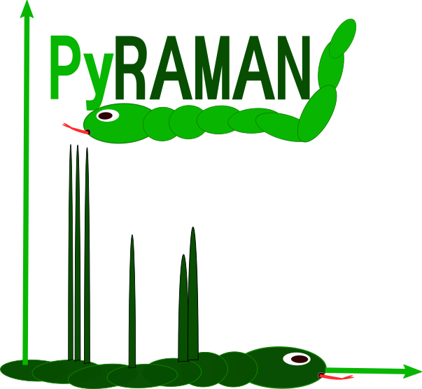

# PyRaman - A general purpose Raman evaluation tool 
  - Author: Simon Brehm (Email: simon.brehm@physik.tu-freiberg.de) 
  - Coding language: Python 

# Description
Provides a general purpose tool for Raman spectra evaluation
  - structure similar to Origin 
  - use of spreadsheets and plotting windows
  - projects can be saved and loaded
  - general-purpose background fitting procedure 
  - RAMAN spectra database 
  - increased reproducibility of fitting processes 
  
A Tutorial how to use PyRaman can be found here [Tutorial](doc/Tutorial.md)

# Installation 
The code needs the following packages 
  - matplotlib (version 3.3.0)
  - pandas 
  - sympy
  - pyqt5 ( pip3 install PyQt5==5.12.2) 
  - prettytable  
  - tabulate
  - operator
  - pickle
  - rampy
  - packaging

# License
This project is licensed under the Apache License 2.0   
See [LICENSE](LICENSE) for details.
