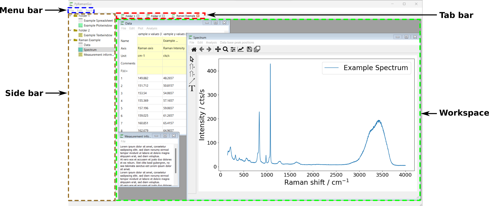
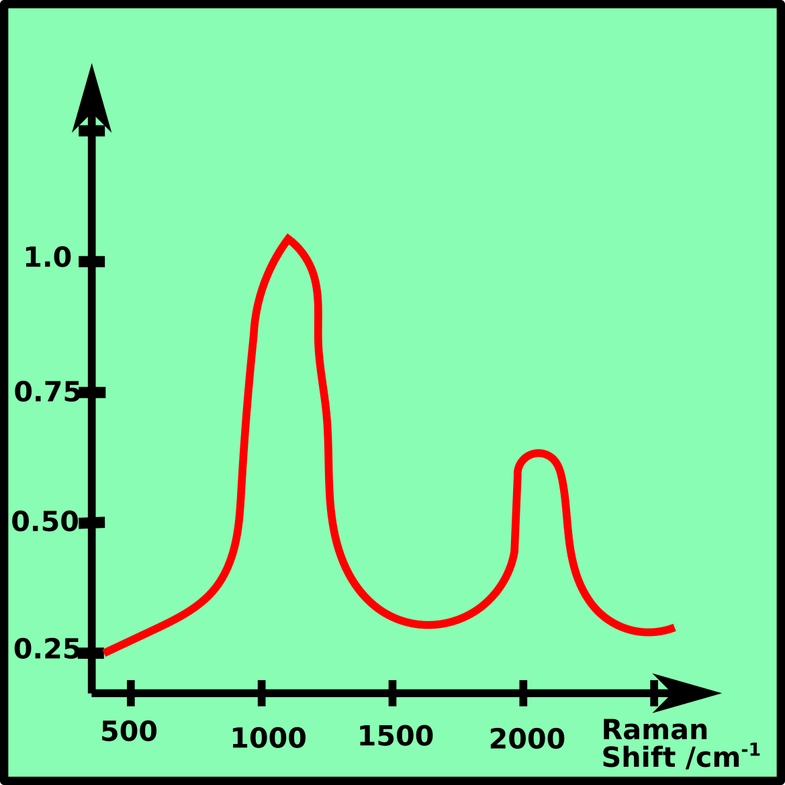
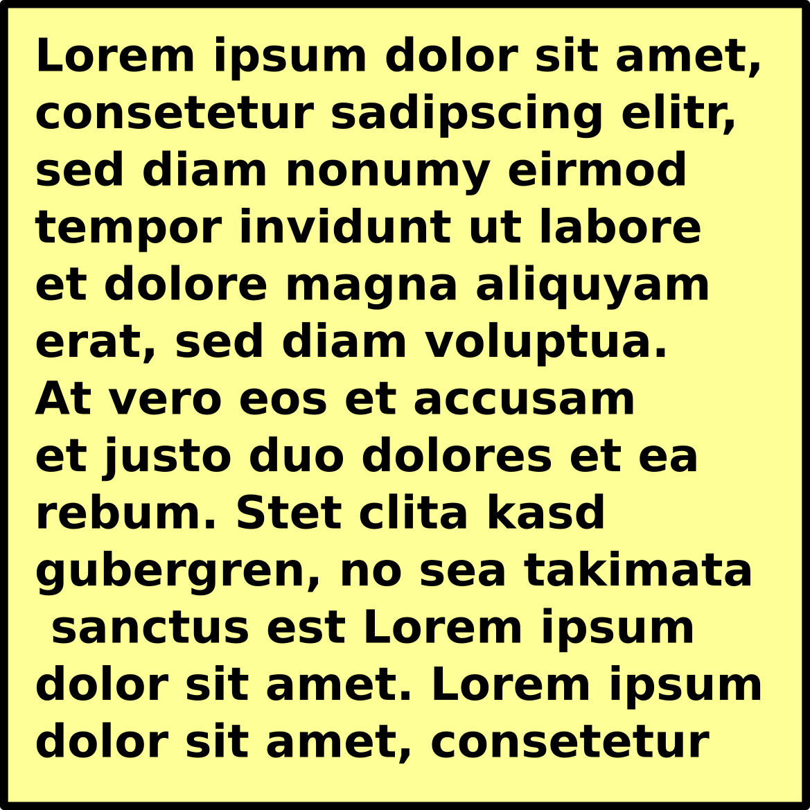
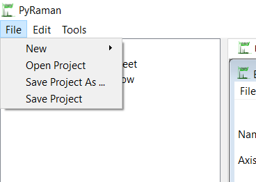
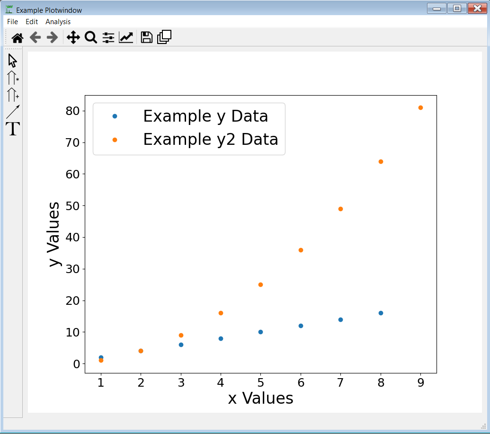
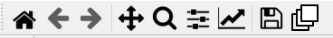
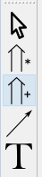
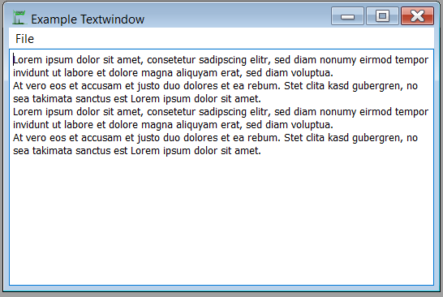

# PyRaman Tutorial

## Introduction
PyRaman is a free and open-source tool to process Raman spectra. 
The source code is written in Python, the GUI is based on PyQt5.
    
## Installation 

- install Python 
- install additional necessary packages (compare [General Information](../README.md))

## General Structure 

### Main window 
The structure of the PyRaman GUI is remotely based on OriginLab. 
The GUI consists of three main parts, which are framed in the
following picture; a menu bar at the top, a side tree at the 
left, and a workspace containing the open windows.

#### Workspace
The workspace contains the windows. There are three different kinds of windows,
[Spreadsheet ](#Spreadsheet), 
[Plotwindow ](#Plotwindow),
[Textwindow ](#Text Window).
They are explained in more detail in later sections.

#### Side bar
The side bar contains the project structure. 
The windows are organized in folders, so the workspace only
shows the windows of the selected folder. You can switch between 
folders by double-clicking at another folder at the side tree or by 
changing the tab of the workspace.

#### Menu bar
The menu bar of the main window contains the items "File", "Edit" and "Tools".

## Tutorial 
#### Open and Save a PyRaman Project
A PyRaman project can be saved and reloaded via the menu item "File".
All files end on .rmn.
A project can also be saved with the shortcut "CTRL+S".

#### Open a new Window or Folder in the Project
There are two ways to open a new folder or window. 
The first one is to use the menu bar item "File" &rarr; "New" and the second one is to 
right-click on the side tree. 
The new window then opens in the opened folder.

##  Spreadsheet 

The spreadsheet contains the data in a table, which can either be loaded ("File"
&rarr; "Load Data") or filled in manually.\
A new column can be added with "Edit" &rarr; "New Column".
\
The header of the table consists of a column title and 5 rows 
("Name", "Axis", "Unit", "Comments", "F(x)").
\
By right-clicking on the column title, a drop-down menu is opened.

### Plot Spreadsheet Data
Select one or several y columns which you mean to plot. 
The data can be plotted over the drop-down menu or the menu bar at the top. 
For the x values, the closest column on the left side of the selected column is used.

##  Plot Window 

The plot window is the most complex of the three windows.

### Toolbar

The first five tools help with navigation:

- house: restore original view
- left arrow: undo view
- right arrow: redo view
- arrow cross:
  - left click + mouse movement: move plot
  - right click + mouse movement: scaling
- magnifier: zoom in

The slide controller button opens a 
dialogue window to adjust the spacing at the left, right, bottom, and top of the plot.

The indented arrow button opens a dialogue with the figure options, e.g., 
for renaming the labels, changing colors, repositioning the legend.

The disc button allows for saving a picture of the plot as a .png file. 

### Sidebar

 

The first symbol (mouse cursor) plots a movable vertical line in the spectrum, 
which can be used, e.g., to compare peak positions. The vertical line disappears
if the symbol on the sidebar is clicked again or the right mouse button is pressed.

With the second and third symbol (upwards arrows), the shown spectra can be scaled 
or shifted with respect to the y-axis.

The fourth symbol (narrow arrow) allows for drawing lines and arrows in the spectrum.
These lines and arrows can be edited later via an option dialogue, which opens with a right mouse click.

The fifth symbol (upper-case T) creates a text field in the spectrum. The text
can be changed by double-clicking and the style can be adjusted by a right mouse click
on the inserted text.

### Menu bar
The menu bar consists of three drop-down menus (File, Edit, Analysis) and a fourth menu item (Data base peak position)

- **File** 
  - **save to file**: save the plotted data in .txt file
- **Edit**
  - **delete data point**
  - **remove cosmic spikes**
  - **define data area**
  - **shift spectrum to zero line**
  - **normalize spectrum**
  - **add up or subtract two spectra**
- **Analysis**
  - **fit**
  - **baseline correction**
  - **smoothing**
  -

#### Baseline Correction
- rubber band
- polynomial
- spline
- asymmetric least square
- adaptive iteratively reweighted penalized least squares
- asymmetrically reweighted penalized least squares
-doubly reweighted penalized least squares.

#### Smoothing
- Savitzky-Golay
- Whittaker

## Text Window 

The text window offers an opportunity to take notes and document a project.
