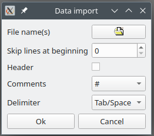
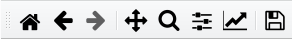
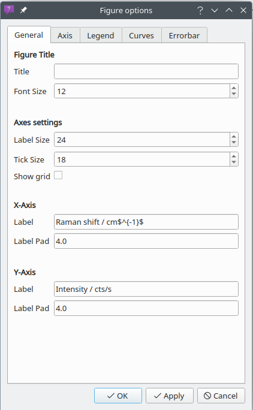
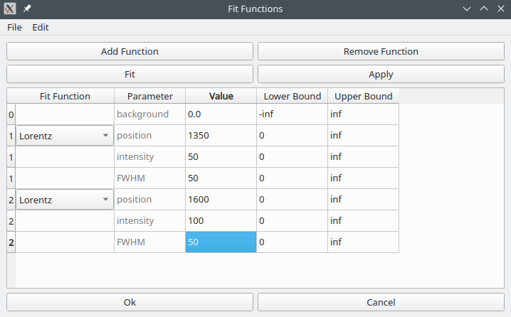

PyRamanGUI
===================

# Table of Content
1. [Introduction](#introduction)
2. [Requirements and Installation](#requirements-and-installation)
   1. [Linux](#linux)
   2. [Windows](#windows)
3. [The Interface](#the-interface)
   1. [Main Window](#main-window)
   2. [Spreadsheet](#spreadsheet-img-srcpicsiconspreadsheetpng-alticon-of-spreadsheet-height20)
   3. [Text Window](#text-window-img-srcpicsicontextwindowpng-alticon-of-textwindow-height20)
   4. [Plot Window](#plot-window-img-alticon-of-plotwindow-height20-srcpicsiconplotwindowpng)

# Introduction

PyRamanGUI is a free and open-source tool to process Raman spectra. 
The source code is written in Python, the GUI is based on PyQt5.
    
# Requirements and Installation
PyRamanGUI requires:
  - [python](https://www.python.org/downloads/) >= 3.10
  
The following python packages have to be installed:
  - matplotlib (3.7.0)
  - numpy (1.24.2)
  - prettytable (3.6.0)
  - pybaselines (1.0.0)
  - PyQt5 (5.15.9)
  - PySide2 (5.15.2.1)
  - rampy (0.4.9)
  - scipy (1.10.1)
  - sklearn (1.2.1)

It may also work with other versions, but it has been tested only with these.

## Linux
On **Linux** (Ubuntu, Debian) the packages can be installed with following command:
```
pip install matplotlib==3.7.0 numpy==1.24.2 prettytable==3.6.0 pybaselines==1.0.0 pyqt5==5.15.9 pyside2==5.15.2.1 rampy==0.4.9 scipy==1.10.1 scikit-learn==1.2.1 
```
Open a terminal and go to the directory where you want to clone the files.
Run the following command. Git automatically creates a folder with the repository name and downloads the files there.
```
git clone https://gitlab.com/brehmsi/PyRamanGUI.git
```
Change directory to source files
```
cd pyramangui/src
```
Run PyRamanGUI
```
python3 PyRamanGUI.py
```


## Windows
On **Windows** with Anaconda:
Install [Anaconda](https://www.anaconda.com/products/distribution). 

Open the Anaconda Command Prompt (CMD.exe Prompt)

Run as administrator
```
pip install --user matplotlib==3.7.0 numpy==1.24.2 prettytable==3.6.0 pybaselines==1.0.0 pyqt5==5.15.9 pyside2==5.15.2.1 rampy==0.4.9 scipy==1.10.1 scikit-learn==1.2.1 
```


Download the PyRamanGUI directory. To run PyRamanGUI, go in the directory src and double-click the 'WindowsRun.bat' file

Alternative: Open the Anaconda Command Prompt and run 
```
python my/path/src/PyRamanGUI.py
```

# The Interface

## Main window
The structure of the PyRamanGUI is remotely based on OriginLab. 
The GUI consists of three main parts, as shown in the following figure; a menu bar at the top, a sidebar on the left, 
and a workspace containing the open sub-windows.


### Workspace
The workspace contains the windows. There are three types of windows:
[Spreadsheet ](#spreadsheet), 
[Plotwindow ](#plot-window),
[Textwindow ](#text-window).
They are explained in more detail in later sections.

### Sidebar
The sidebar contains the project tree. 
The sub-windows are organized in folders, so the workspace displays only the sub-windows of the selected folder. 
You can switch between folders by double-clicking on another folder in the sidebar or by changing the tab of the 
workspace.

### Menu bar
The menu bar of the main window contains the drop-down menus "File", "Edit" and "Tools". 
In addition to the main window menu bar, each sub-window has its own menu bar

### Open and Save a PyRamanGUI Project
A project can be saved and reloaded using the File menu. Projects are saved as JSON files, all of which have the 
.rmn extension.
A project can also be saved using the CTRL+S key combination.


### Open a new Window or Folder in the Project
There are two ways to open a new folder or window. The first one is to use the menu bar item "File" ->; "New" and the 
second one is to right-click on the sidebar. The new window will be opened in the opened folder.


##  Spreadsheet 


The spreadsheet contains the data in a table, which can either be loaded ("File"
&rarr; "Load Data") or filled in manually.\
A new column can be added with "Edit" &rarr; "New Column".
\
The header of the table consists of a column title and 5 rows 
("Name", "Axis", "Unit", "Comments", "F(x)").
\
By right-clicking on the column title, a drop-down menu is opened.

### How to work with a Spreadsheet
#### Load data
Open a spreadsheet and click "File"->"Load Data" in the menu bar. In the open data 
import menu, you can select the path to the file to load and other basic 
import options.



#### How to plot data
To plot the loaded data, there must be at least two columns. Each column can be of type "X", "Y" or "Yerr". 
To plot data, select one or more columns of type "Y". The data can be plotted using the drop-down menu via right-click 
on the column header or the menu bar at the top. As x-values, the corresponding column of type "X" (the closest column 
to the left) is automatically selected.

#### Functionalities
There are other functions that can be used in the spreadsheet. They can be found via the menu bar or by right-clicking 
on the column header. These functions include:
- Move a column one to the right, one to the left, or to the end or beginning of the spreadsheet.
- Delete a column.
- Change the type of column.
- Flip a column.
- Convert units: If values in the selected column are in units of wavenumbers, they can be converted to a wavelength 
and vice versa.
- Resample: Create a new x-axis for selected "Y" columns
- Principal component analysis (PCA)
- Non-negative matrix factorization (NMF)

The resampling, PCA and NMF are explained later in more detail.

#### Resampling new x-axis
Sometimes it is necessary to resample data with respect to a new x-axis. For example, if two spectra are to be 
subtracted and have a slightly different x-axis. PCA and NMF also require spectra to have the same x-axis.

To do this, select all the y-columns you want to resample and click "Edit" -> "Resample" from the spreadsheet menu bar. 
A new spreadsheet will open with the resampled data.

#### PCA and NMF
Principal component analysis (PCA) and non-negative matrix factorization (NMF) are multivariate statistical methods 
used to reduce the dimensionality of data. They can be used in Raman spectroscopy, for example, to extract the signal 
of a thin film from the substrate signal. The input data would be Raman spectra measured at different depths.

## Text Window 


The Text window provides a place to take notes and document a project. Text can be saved to or loaded from a .txt file.

##  Plot Window 


The Plot window is the most complex of the three windows. We will look at its structure and at the functions it 
provides.

### Toolbar
The toolbar is located just below the Plot Window menu bar.



The first five tools help you navigate a spectrum, while the latter three are there to restyle or save the plot:

- House: Restore original view
- Left arrow: Undo view
- Right arrow: Redo view
- Arrow cross:
  - Left click + mouse movement: move plot
  - Right click + mouse movement: scaling
- Magnifier: zoom in
- The slider button opens a dialog box to adjust the spacing at the left, right, bottom and top of the plot.
- The indented arrow button opens a dialog with figure options, e.g. for renaming labels, changing colors, 
repositioning the legend. More information about the figure options dialog is given later.
- The disk button allows you to save an image of the plot as an image file (.png, .jpg, .eps, .pdf, ...).

### Sidebar

 

- The first icon (mouse pointer) draws a movable vertical line in the spectrum, which can be used, for example, 
to compare peak positions. The vertical line disappears when the icon is clicked again in the sidebar or when the right 
mouse button is pressed.
- The second and third icons (up arrows) can be used to scale or move the spectra with respect to the y-axis.
- The fourth icon (narrow arrow) allows you to draw lines and arrows in the spectrum. These lines and arrows can be 
edited later using an options dialog that opens with a right mouse click.
- The fifth icon (capital T) creates a text box in the spectrum. 
The text can be changed by double-clicking, and the style can be changed by right-clicking on the inserted text.

### Figure option dialog
The figure options dialog contains all the styling options for a plot.

 

The dialog is divided into four panels, which can be toggled using the tabs at the top. The fifth panel "Errorbar" is 
only displayed if the plotted data has an error bar.
- General: The title, labels and its font sizes can be changed here.
- Axis: Limits of the displayed data area, axis breaks.
- Legend: Font size and style of the legend
- Curves: Style, width and color of the display curves
- Errorbar: Style, width and color of the error bars

### Functionalities

#### Delete single data point

#### Remove cosmic spike

#### Set new limits

#### Normalization

#### Add up or subtract two spectra

#### Baseline correction

#### Smoothing

#### Peak Fitting
There are two peak fitting options. The quick fit and via the Fit Dialog.

For both first a dialog opens, which ask for the dataset, which should be fitted? \
Then two red lines appear. By dragging them to the wanted position, the 
fit region can be chosen. \



The fitdialog consists of a menubar, four buttons:
- Add Function: add fit function 
- Remove Function: remove fit function 
- Apply: Plot functions spectrum with given parameter 
- Fit: Fit parameters to selected spectrum 

and a table: \
In the left column a fit function can be selected:
- Lorentzian
- Gaussian
- Breit-Wigner-Fano
- Voigtian
- Pseudo-Voigtian

The other columns are used to enter values for the fit parameters, 
the lower and the upper boundary limit.


