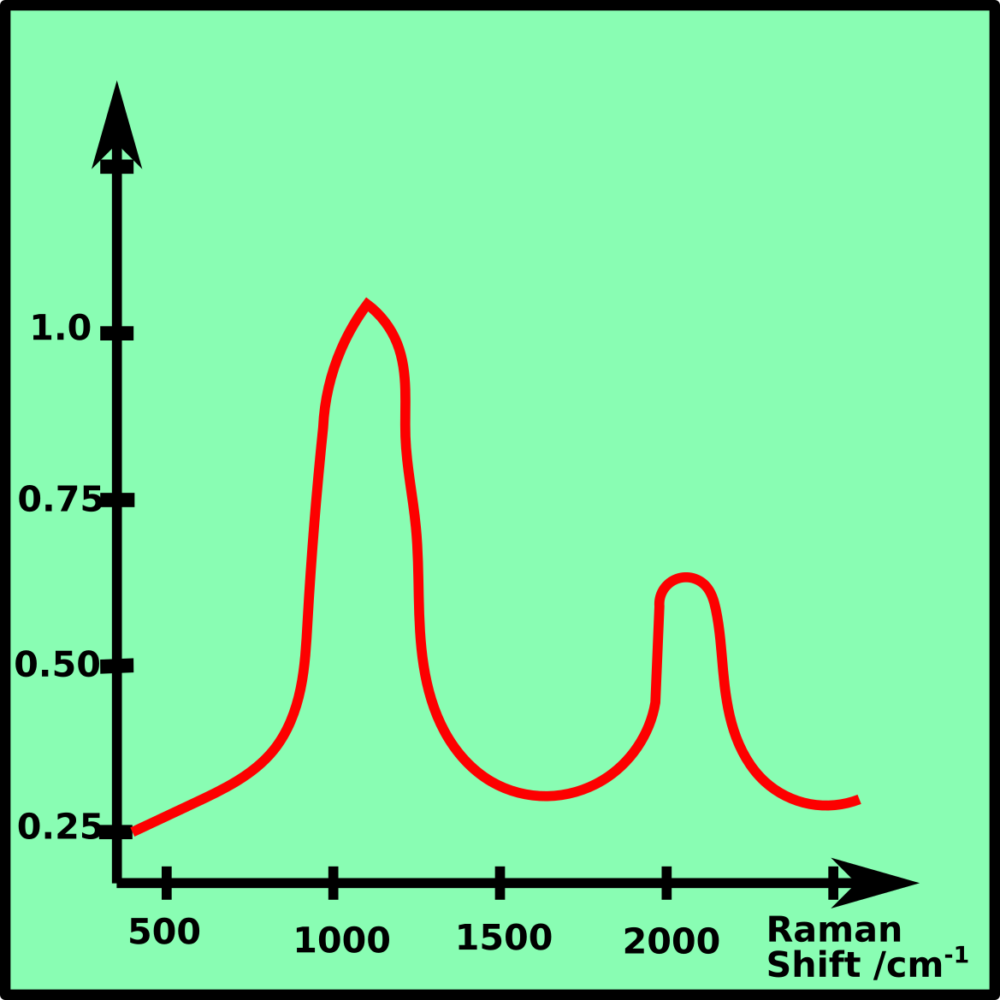
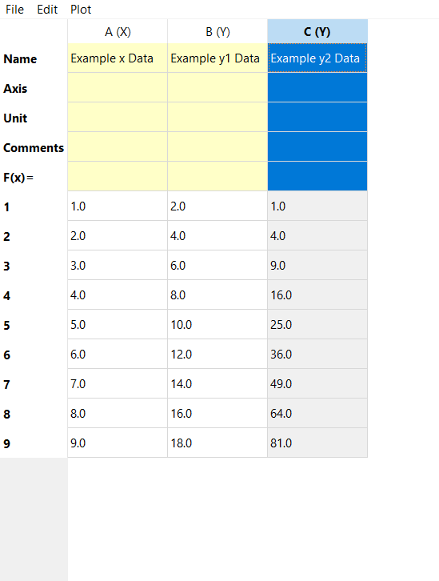

# Tutorial
how to use PyRaman

## Introduction
PyRaman is a tool to process Raman spectra. It is free and open-source. 
The source code is written in Python. 
- Gui written in PyQt5
    
## Installation 
- first install python 
- needed packages

## General Structure 
The structure of PyRaman is remotely based on OriginLab. 
It consists of three main parts framed in red in the
following picture; a menu bar at the top a side tree at the 
left and a workspace containing the open windows.

The windows are organized in folders, so that the workspace only
shows the windows of the selected folder. You can switch between 
folders by double clicking at another folder at the side tree or by 
changing the tab of the workspace.
There are three different kinds of windows,
[Spreadsheet ](#Spreadsheet),
[Plotwindow ](#Plotwindow),
[Textwindow ](#Textwindow).
They are explained in more detail in the following sections.

### Menu bar of the Main Window

#### Open and Save a PyRaman-Project
A PyRaman project can be saved and reloaded via the menu item "File".
All files end on .rmn.
A project can also be saved with the shortcut "STRG+S".

#### Open a new Window or Folder in the Project
There are two ways to open a new folder or window. 
The first one ist to use the menu bare item "File" &rarr; "New" and the second one is to 
right click on the side tree. 
The new window will be opened in the opened folder.

##  Spreadsheet 

The Spreadsheet contains the data in a table, which can either be loaded ("File"
&rarr; "Load Data") or filled in manually.\
A new column can be added with "Edit" &rarr; "New Column".
\
The header of the table consists of a column title and 5 rows 
("Name", "Axis", "Unit", "Comments", "F(x)").
\
With right-click on the colum title a drop-down menu is opened.

### Plot spreadsheet data
Select one or several Y-columns, which should be plotted. 
The data can be plotted over the drop-down menu or the menubar at the top. 
As X-values the closest column on the left side of the selected column is used.

##  Plotwindow 

The Plotwindow is the most complex of the three windows.

### The toolbar

The first five tools help to navigate:

- house: restore original view
- left arrow: undo view
- right arrow: redo view
- the arrow cross:
  - left-click + mouse movement: move plot
  - right-click + mouse movement: scaling
- the magnifier: zoom in

The button with the slide controller as an icon opens a 
dialog window to adjust the spacing at the left, right, bottom and top of the plot.

The button with the indented arrow opens a dialog with the figure options, like 
renaming the labels, change colors, repositioning the legend ...

With the diskette a picture (*.png file) of the plot can be saved. 

### The sidebar

 

The first symbol (mouse cursor) plots a movable vertical line in the spectrum, 
which e.g. can be used to compare peak positions. The vertical line disappears,
if the symbol on the sidebar is clicked again or the right mouse button is pressed.

With the second and third symbol (upwards arrows) the shown spectra can be scaled 
or shifted regarding the y-axis.

The fourth symbol (narrow arrow) allows drawing lines and arrows in the spectrum.
They can be edited later over an option dialog, which opens with a right mouse click.

The last and fifth symbol (big T) creates a text field in the spectrum. The text
can be change by double click and the style can be adjusted by a right mouse click
on the inserted text.

### Baseline Correction

## Textwindow 

The Textwindow offers an easy was to take notes and document a project.