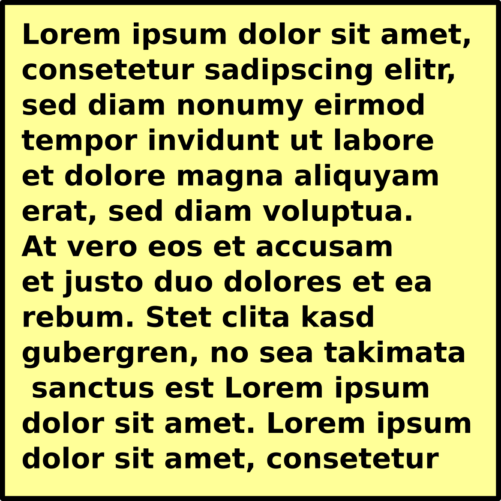

# Tutorial
how to use PyRaman

## Introduction
PyRaman is a tool to process Raman spectra. It is free and open-source. 
The source code is written in Python. 
- Gui written in PyQt5
    
## Installation 
- first install python  
- needed packages

## General Structure 
The structure of PyRaman is remotely based on OriginLab. 
It consists of three main parts framed in red in the
following picture; a menu bar at the top a side tree at the 
left and a workspace containing the open windows.
The windows are organized in folders, so that the workspace only
shows the windows of the selected folder. You can switch between 
folders by clicking at another folder at the side tree or by 
changing the tab of the workspace.

There are three different kinds of windows,
[Spreadsheet ](#Spreadsheet),
[Plotwindow ](#Plotwindow),
[Textwindow ](#Textwindow).
They are explained in more detail in the following sections.

### Menu bar of the Main Window

#### Open and Save a PyRaman-Project
A PyRaman project can be saved and reloaded via the menu item "File".
All files end on .rmn.
A project can also be saved with the shortcut "STRG+S".

#### Open a new Window or Folder in the Project

####  Spreadsheet 

####  Plotwindow 

#### Textwindow 

